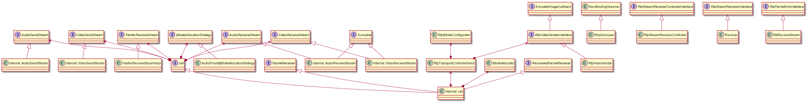

# call

类图关系：  

## 1. call

核心流程：主要是用于创建  

1. 在PeerConnectionFactory::CreatePeerConnection中调用CreateCall_w创建call对象，随后会传入WebRtcVoiceMediaChannel和WebRtcVideoChannel
   - 调用call_factory_->CreateCall创建call对象（调用Call::Create）
2. 在WebRtcVoiceMediaChannel::WebRtcAudioSendStream构造函数中调用call_->CreateAudioSendStream(config_)创建audio发送stream_
3. 在WebRtcVoiceMediaChannel::WebRtcAudioReceiveStream构造函数中调用call_->CreateAudioReceiveStream(config_)创建audio接收stream_
4. 在WebRtcVoiceMediaChannel::OnPacketReceived中调用call_->Receiver()->DeliverPacket接收audio的rtp包
5. 在WebRtcVoiceMediaChannel::OnRtcpReceived中调用call_->Receiver()->DeliverPacket接收audio的rtcp包
6. 在WebRtcVoiceMediaChannel::OnNetworkRouteChanged中调用call_->GetTransportControllerSend()->OnNetworkRouteChanged和call_->OnTransportOverheadChanged通知网络路由发生改变
7. 在WebRtcVoiceMediaChannel::OnReadyToSend中调用call_->SignalChannelNetworkState设置网络连接或者断开
8. 在WebRtcVideoChannel::SetSendParameters中调用call_->GetTransportControllerSend()->SetSdpBitrateParameters将sdp协商好的码率设置到transport controller send中
9. 在WebRtcVideoChannel::GetStats中调用call_->GetStats()获取call层次的统计信息
10. 在WebRtcVideoChannel::OnPacketReceived中调用call_->Receiver()->DeliverPacket接收video的rtp包
11. 在WebRtcVideoChannel::OnRtcpReceived中调用call_->Receiver()->DeliverPacket接收video的rtcp包
12. 在WebRtcVideoChannel::OnReadyToSend中调用call_->SignalChannelNetworkState设置网络连接或者断开
13. 在WebRtcVideoChannel::OnNetworkRouteChanged中调用call_->GetTransportControllerSend()->OnNetworkRouteChanged和call_->OnTransportOverheadChanged通知网络路由发生改变
14. 在WebRtcVideoChannel::WebRtcVideoSendStream::RecreateWebRtcStream()中调用call_->CreateVideoSendStream创建video发送stream_
15. 在WebRtcVideoChannel::WebRtcVideoReceiveStream::RecreateWebRtcVideoStream()中调用call_->CreateVideoReceiveStream创建video接收stream_
16. 在WebRtcVideoChannel::WebRtcVideoReceiveStream::MaybeRecreateWebRtcFlexfecStream()中调用call_->CreateFlexfecReceiveStream创建flexfec stream_

## 2. internal::call

* call构造函数
  * 创建处理线程module_process_thread_（挂载几个主要的模块remote_estimator，call_stats_，receive_side_cc_），这个线程对象还会传递到其他stream对象中
  * 创建BitrateAllocator对象bitrate_allocator_，其中内部的limit_observer_对象是call本身。并传入AudioSendStream/VideoSendStream
  * 创建ReceiveSideCongestionController对象receive_side_cc_
  * 由参数创建RtpTransportControllerSendInterface对象transport_send_，并调用transport_send->RegisterTargetTransferRateObserver(this)注册相关observer
* Receiver()返回this指针，很多地方用这个函数来接收rtp数据
* CreateAudioSendStream()创建AudioSendStream对象，保存在audio_send_ssrcs_中，需要注意的是这一路ssrc对应的流的rtcp是在另外一个AudioReceiveStream中管理的
* CreateAudioReceiveStream()创建AudioReceiveStream对象，保存在audio_receive_streams_中，需要注意的是其中会负责某一个send stream的rtcp的发送
* CreateVideoSendStream()创建VideoSendStream对象，保存在video_send_streams_中，另外也保存在video_send_ssrcs_中
* CreateVideoReceiveStream()创建VideoReceiveStream对象，保存在video_receive_streams_中
* CreateFlexfecReceiveStream()创建FlexfecReceiveStreamImpl对象，其中RecoveredPacketReceiver是call对象本身，恢复后的包会通过RecoveredPacketReceiver传递回来
* GetTransportControllerSend()返回transport_send_ptr_，即transport_send_的指针对象
* GetStats()返回call层次的统计信息
* OnSentPacket()会更新video_send_delay_stats_统计信息，也会更新底层send_side_cc_的信息。这个函数会在PeerConnection::OnSentPacket_w中调用
* OnTargetTransferRate()更新目标码率，这个函数会在RtpTransportControllerSend::OnNetworkChanged调用
* OnAllocationLimitsChanged()更新码率上下限，这个函数会在BitrateAllocator::UpdateAllocationLimits()中调用

## 3. AudioReceiveStream/AudioSendStream/VideoReceiveStream/VideoSendStream

这几个类都是纯虚基类，具体的子类实现分别在audio/video目录下。

## 4. AudioState

AudioState是在多个音频处理实例间共享状态的一个类，会在call_config中保存，并通过构造函数传递到AudioReceiveStream和AudioSendStream中

## 5. BitrateAllocator

BitrateAllocator用于根据目标码率/丢包率/rtt等分配码率，并通知相应的observers。  
核心流程：  

1. 在Call::OnTargetTransferRate中会调用bitrate_allocator_->OnNetworkChanged进行码率分配
2. BitrateAllocator中observers对象分别是AudioSendStream和VideoSendStreamImpl对象

## 6. FlexfecReceiveStreamImpl

接收flexfec流，并进行丢包恢复，恢复后的包通过call对象的函数OnRecoveredPacket回调回来。

核心流程：  

1. 在WebRtcVideoChannel::WebRtcVideoReceiveStream::MaybeRecreateWebRtcFlexfecStream()创建FlexfecReceiveStreamImpl对象flexfec_stream_
2. 通过stream_->AddSecondarySink(flexfec_stream_)配置数据流链路，此时stream_实际上是VideoReceiveStream。当stream_收到rtp包时，会调用flexfec_stream_的OnRtpPacket函数进行处理

## 7. RtpBitrateConfigurator

主要是用于计算最大/最小/初始码率

## 8. rtp_config.h

### 8.1 RtpPayloadState

当前仅用于vp8/vp9，主要有这几个属性：picture_id，tl0_pic_idx，shared_frame_id

### 8.2 NackConfig

nack的属性，主要有：rtp_history_ms，表示发送侧需要缓存的最大rtp时长，接收侧需要等待重传的最大rtp时长

### 8.3 UlpfecConfig

ulpfec属性，主要有这几个属性：ulpfec_payload_type，red_payload_type，red_rtx_payload_type

### 8.4 RtpConfig

主要有：
* ssrcs：ssrc的列表，可能有多个ssrc
* mid：当前流的mid，如果有mid的扩展，此字符串会包含在扩展中
* rtcp_mode：rtcp的模式，例如：kOff，kCompound，kReducedSize，在RFC5506有描述
* max_packet_size：rtp最大字节数
* extensions：扩展
* payload_name：payload名
* payload_type：pt
* nack：NackConfig类型
* ulpfec：UlpfecConfig类型
* flexfec：Flexfec类型，包含payload_type（flexfec pt），ssrc，protected_media_ssrcs（保护的ssrc列表）
* rtx：Rtx类型，包含ssrcs列表（哪些ssrc被重传），payload_type（rtx pt）
* c_name：sdes的pt

### 8.5 RtcpConfig

用于配置rtcp包发送间隔，主要有：video_report_interval_ms，audio_report_interval_ms

## 9. RtpStreamReceiverController/Receiver

用于控制接收rtp时的处理。核心流程（以video为例）：  

1. 在call类中作为成员属性存在video_receiver_controller_，会传递到VideoReceiveStream对象中，然后将video_receiver_controller_与后续sink管理，sink包括：RtpVideoStreamReceiver对象rtp_video_stream_receiver_，RtxReceiveStream对象rtx_receive_stream_，FlexfecReceiveStreamImpl对象
2. 在Call::DeliverRtp中调用video_receiver_controller_.OnRtpPacket传递rtp包，后续会根据需要调用绑定的相关sink的处理方法
3. 在Call::OnRecoveredPacket中调用video_receiver_controller_.OnRtpPacket传递恢复后的rtp包

## 10. RtpTransportControllerSend

用于涉及到rtp传输的所有信息，例如包括rtp_video_sender, pacer, route等。核心流程：  

1. 在call构造函数中调用transport_send->RegisterTargetTransferRateObserver(this)注册码率发生改变的observer
2. 传递到AudioSendStream/VideoSendStream对象中，会发现这里接收相关对象
3. 当发送包时在Call::OnSentPacket调用transport_send_ptr_->OnSentPacket
4. 在VideoSendStreamImpl构造函数中调用transport_->CreateRtpVideoSender创建rtp_video_sender_，调用transport_->RegisterPacketFeedbackObserver(this)注册observer
5. 在AudioSendStream构造函数中调用transport_->RegisterPacketFeedbackObserver注册observer
6. 在WebRtcVideoChannel/WebRtcVoiceMediaChannel中调用SetSdpBitrateParameters设置码率上下限
7. 在WebRtcVideoChannel/WebRtcVoiceMediaChannel中调用OnNetworkRouteChanged通知路由发生变化

## 11. RtpVideoSender

核心流程：  

1. 在VideoSendStreamImpl构造函数中创建RtpVideoSender对象rtp_video_sender_
2. 根据rtp_video_sender_是否支持fec/nack，传递给fec_controller_，后续会根据这个配置分配各方码率
3. 在VideoSendStreamImpl::RegisterProcessThread调用rtp_video_sender_->RegisterProcessThread(module_process_thread)注册线程对象
4. 在VideoSendStreamImpl::DeliverRtcp调用rtp_video_sender_->DeliverRtcp传递rtcp包
5. 在VideoSendStreamImpl::OnBitrateAllocationUpdated中调用rtp_video_sender_->OnBitrateAllocationUpdated更新码率分配策略
6. 在VideoSendStreamImpl::OnEncodedImage中调用rtp_video_sender_->OnEncodedImage处理编码后的帧数据
7. 在VideoSendStreamImpl::ProtectionRequest中调用rtp_video_sender_->ProtectionRequest获取发送的video/nack/fec的码率
8. 在VideoSendStreamImpl::SetTransportOverhead中调用rtp_video_sender_->SetMaxRtpPacketSize更新最大rtp包字节

## 12. RtxReceiveStream

核心流程：

1. 在VideoReceiveStream构造函数中创建RtxReceiveStream对象rtx_receive_stream_，同时rtx_receive_stream_也是receiver_controller的一个sink
2. 由于rtx_receive_stream_是receiver_controller的一个sink，因此当收到rtp包时，会根据rtx的ssrc，将rtx的包传递给rtx_receive_stream_
3. 在RtxReceiveStream::OnRtpPacket中会将rtx解析为原始包，并调用media_sink_->OnRtpPacket(media_packet)，而media_sink_实际上是RtpVideoStreamReceiver对象rtp_video_stream_receiver_

## 13. Syncable

* AudioReceiveStream和VideoReceiveStream都会继承Syncable，后续会获取Syncable::Info信息用于同步
* id()：返回对应流的ssrc
* GetInfo()：返回audio/video的Syncable::Info
* GetPlayoutTimestamp()：audio返回当前播放的rtp包的ts，视频则返回0
* SetMinimumPlayoutDelay()：设置最小的播放时延，比如audio设置neteq的缓冲

