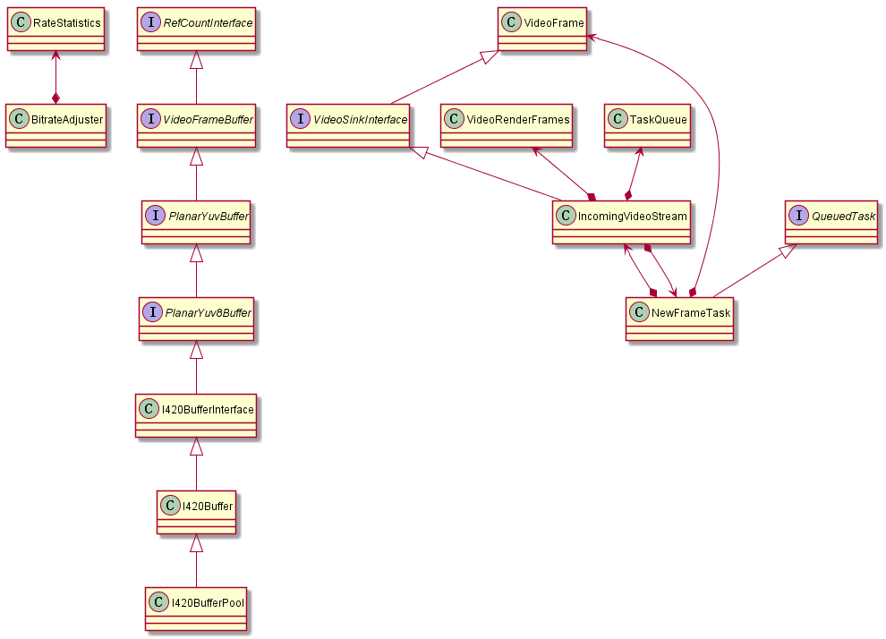

# common_video

## 1. BitrateAdjuster

核心流程：

1. 构造BitrateAdjuster对象_bitrateAdjuster，设置好最小和最大调整比例pct
2. 设置当前的目标码率，_bitrateAdjuster->SetTargetBitrateBps
3. 当编码前，设置目标码率，目标码率从_bitrateAdjuster->GetAdjustedBitrateBps()获得
4. 每次编码完一帧，需要调用_bitrateAdjuster->Update更新每帧帧长

## 2. I420BufferPool

I420Buffer对象内存池

* I420BufferPool()：传入内存池最大buffer个数
* CreateBuffer()：根据分辨率创建I420Buffer的buffer，当buffer被释放时，buffer的引用计数器为1，因此可以重复利用。这就是内存池本身的设计意图。
* Release()：释放内存池。

## 3. IncomingVideoStream

核心流程：

1. 在VideoReceiveStream::Start()中创建IncomingVideoStream对象incoming_video_stream_，同时会传入VideoStreamDecoder对象video_stream_decoder_，主要是在VideoStreamDecoder中使用。
2. 在VideoStreamDecoder::FrameToRender中调用incoming_video_stream_->OnFrame(video_frame)传入一帧数据

* IncomingVideoStream::OnFrame()会创建一个NewFrameTask（QueuedTask子类），其中Run函数会将frame添加到render_buffers_中，然后调用Dequeue()。在Dequeue()中会不断创建Task处理视频帧。

## 4. H264_common/PpsParser/SpsParser/H264BitstreamParser

* FindNaluIndices()：返回H.264码流中nalu的位置信息
* PpsParser解析pps的相关信息
* SpsParser解析sps的相关信息
* H264BitstreamParser解析H.264码流中每个nalu的信息
* 