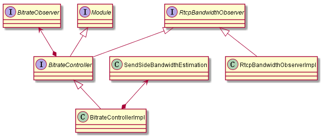

# bitrate_controller

## 1. BitrateObserver基类

观察者对象，用于当带宽发生变化时通知观察者。

* OnNetworkChanged()带宽发生改变时调用
* OnBytesAcked()对方确认收到字节数据
* pacer_queue_size_in_bytes()返回pacer队列大小

## 2. BitrateController/BitrateControllerImpl

* CreateBitrateController()创建BitrateControllerImpl对象
* CreateRtcpBandwidthObserver()创建RtcpBandwidthObserver对象
* SetStartBitrate/SetMinMaxBitrate/SetBitrates/ResetBitrates()重置起始/最小/最大码率
* UpdateMaxContinuousLostPackets()更新最大连续丢包个数
* OnDelayBasedBweResult()基于延时的带宽估计发生变化时调用
* AvailableBandwidth()返回当前可用带宽
* GetNetworkParameters()获取当前带宽/丢包率/rtt
* GetReduceBitrateState/ResetReduceBitrateState()返回/重置当前是否是下降状态
* GetCurrentBitrate()返回当前码率

## 3. SendSideBandwidthEstimation

根据remb/delay_based/packet_lost等信息更新当前估算码率（思想是取最小值），保存一定时间周期内的历史码率等

* CurrentEstimate()返回当前带宽/丢包/rtt
* UpdateEstimate()根据丢包估算带宽（或者根据rtcp接收周期估算带宽）
* UpdateReceiverEstimate()根据remb更新带宽
* UpdateDelayBasedEstimate()根据延时变化估算的带宽更新当前带宽
* UpdateReceiverBlock()根据rr block更新信息
* UpdatePacketsLost()更新丢包率（例如根据rr block中的丢包率）
* UpdateMaxContinuousLostPackets()更新最大连续丢包个数
* UpdateRtt()更新rtt
* SetBitrates()更新当前码率/最大/最小/码率
* SetSendBitrate更新当前码率
* SetMinMaxBitrate()更新最大/最小/码率
* GetMinBitrate()获取最小码率

