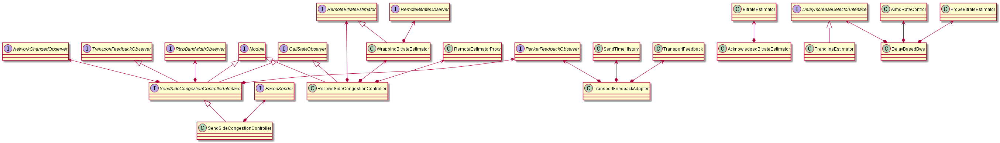

# congestion_controller



## 1. NetworkChangedObserver

带宽观察者

* OnNetworkChanged()后续子类需要实现此函数

## 2. ReceiveSideCongestionController

接收端侧拥塞控制模块，这里分为两个部分（不同阶段的实现）：一个是接收端预测带宽并通过remb反馈给发送端；另一个是接收端统计transport cc信息通过rtcp反馈给发送端

* OnReceivedPacket()当收到包时，会调用此函数。内部会根据是否有transport sequence扩展来调用哪种模式
* GetRemoteBitrateEstimator()根据参数返回不同模式对象
* OnRttUpdate()如果需要接收端估计带宽，会调用此函数更新rtt
* OnBitrateChanged()如果是需要发送transport cc，则使用此函数控制发送频率
* TimeUntilNextProcess/Process，实现Module接口

## 3. SendSideCongestionControllerInterface/SendSideCongestionController

发送端拥塞控制模块

* SendSideCongestionController()：创建发送端相关对象，例如pacer_，bitrate_controller_，acknowledged_bitrate_estimator_，probe_controller_，retransmission_rate_limiter_，delay_based_bwe_，transport_feedback_adapter_等
* RegisterPacketFeedbackObserver/DeRegisterPacketFeedbackObserver：在transport_feedback_adapter_中注册observer
* RegisterNetworkObserver/DeRegisterNetworkObserver：注册保存observer_
* SetBweBitrates：设置起始/最小/最大码率
* SetAllocatedSendBitrateLimits：在pacer_中设置最小发送码率/最大填充码率/最大总体码率等
* OnNetworkRouteChanged：当路由发生改变时调用
* SignalNetworkState：设置网络up/down，连接/断开
* SetTransportOverhead：设置每个包的头大小，transport_overhead_bytes_per_packet_
* GetBitrateController：返回bitrate_controller_对象
* GetBandwidthObserver：返回bitrate_controller_对象
* AvailableBandwidth：返回可用带宽
* GetPacerQueuingDelayMs：返回pacer_中队列大小
* GetFirstPacketTimeMs：返回pacer_中第一个包的时间
* GetTransportFeedbackObserver：返回this
* GetRetransmissionRateLimiter：返回retransmission_rate_limiter_
* SetPerPacketFeedbackAvailable：空实现
* EnablePeriodicAlrProbing：probe_controller_是否允许alr探测
* OnSentPacket：发送一个包时调用，用于在transport_feedback_adapter_中保存发送端时间信息
* OnRttUpdate：在delay_based_bwe_中更新rtt
* TimeUntilNextProcess/Process：实现Module
* AddPacket：将包相关信息（ssrc/seq/len）添加到transport_feedback_adapter_
* OnTransportFeedback：当收到rtcp包（transport feedback）时调用，估算带宽，并调用bitrate_controller_->OnDelayBasedBweResult(result)
* GetTransportFeedbackVector：返回上一次收到的transport feedback的vector
* SetPacingFactor：设置pacer_的因子
* SetAllocatedBitrateWithoutFeedback：设置acknowledged_bitrate_estimator_的码率

## 4. TransportFeedbackAdapter

用于计算transport feedback的信息

* RegisterPacketFeedbackObserver/DeRegisterPacketFeedbackObserver：注册observer，保存在observers_中，可能有多个
* AddPacket：将包信息添加到send_time_history_
* OnSentPacket：更新send_time_history_中当前包的发送时间
* OnTransportFeedback：处理接收到的transport feedback
* GetOutstandingBytes：返回当前还未处理（对方还未收到）的字节
* GetMaxContinuousLostPackets：返回最大连续丢包个数

## 5. GoogCcNetworkControllerFactory

等分析rtp目录中SendSideCongestionController再说

## 6. BitrateEstimator

根据接收时间/包大小计算的一个贝叶斯码率估计。

## 7. AcknowledgedBitrateEstimator

根据对端接收信息（transport cc）进行码率估算。这里主要时利用BitrateEstimator进行码率估算。也会去探测alr是否结束，因为这回影响BitrateEstimator的参数。

## 8. AlrDetector

在WebRTC GCC(Google Congestion Control)中，有一个叫做AlrDetector（应用受限区域探测器，Application limited region detector）的模块。该模块利用某段时间值，以及这段时间发送的字节数判断当前输出网络流量是否受限。这些限制主要跟应用程序本身输出网络流量的能力有关，例如编码器性能，不能编码出设置的目标码率。下面举个简单例子说明下。  

假设我们经过带宽预测后，获取到一个目标码流target_bitrate_bps，此时我们程序需要按照该码率大小进行数据发送，但是一切都不是那么完美，例如编码器。编码器由于各种问题，编码出的数据码率低于target_bitrate_bps，使得数据发送码率低于要求，带宽利用率不足，发送码率占最大预算码率值比例低于某个值的话Alr（Application limited region）就会被触发了，恢复到某个值以上，Alr会停止。  

目前阈值分别是：目标带宽（65%），启动阈值（80%），停止阈值（50%）  

## 9. DelayIncreaseDetectorInterface/DelayBasedBwe/TrendlineEstimator

DelayIncreaseDetectorInterface定义了接口，包含两个函数：Update()用于更新delta时间，State()用于返回当前网络状态（拥塞/正常/没用满）。  
MedianSlopeEstimator：用趋势中值法计算斜率，但是目前没有使用。

### 9.1 TrendlineEstimator

* Update()：更新获得当前斜率，并进行拥塞检测。
* State()：返回当前网络拥塞情况。
* Detect()：该函数主要根据延迟变化增长趋势计算当前网络状态，在Detect函数内部，会根据前面计算得到的斜率得到一个调整后的斜率值：modified_trend。然后与一个动态阈值threshold_作对比，从而得到网络状态。modified_trend > threshold_，表示overuse状态；modified_trend < -threshold_，表示underuse状态；-threshold_ <= modified_trend <= threshold_，表示normal状态。
* UpdateThreshold()：阈值自适应调整为了改变算法对延迟梯度的敏感度。根据主要有以下两方面原因：1）延迟梯度是变化的，有时很大，有时很小，如果阈值是固定的，对于延迟梯度来说可能太多或者太小，这样就会出现不够敏感，无法检测到网络拥塞，或者过于敏感，导致一直检测为网络拥塞；2）固定的阈值会导致与TCP（采用基于丢包的拥塞控制）的竞争中被饿死。

### 9.2 DelayBasedBwe

核心流程：

1. 在SendSideCongestionController构造函数中创建DelayBasedBwe对象delay_based_bwe_
2. 在SendSideCongestionController::SetBweBitrates中调用SetMinBitrate/SetStartBitrate设置最小/起始码率
3. 在SendSideCongestionController::OnRttUpdate中调用OnRttUpdate更新rtt
4. 在SendSideCongestionController::OnTransportFeedback中调用IncomingPacketFeedbackVector输入transport feedback的信息进行计算，估算出当前delay_based带宽

## 10. ProbeBitrateEstimator

webrtc使用gcc（google congestion control）来估计带宽，控制当前的发送速度。gcc中基于丢包和基于延迟的算法有个特点：
* 能迅速响应带宽的衰减
* 不能迅速响应带宽的增加

举个例子，如果当前带宽是20mbps，由于其它因素，带宽骤降至15mbps，gcc能快速的给出over-using信号(rtt为10ms环境下，响应速度是100-200ms)。
如果当前带宽是20mbps，由于其它因素，带宽升至了25mbps，依赖gcc自身的调整的话需要几十秒的时间（加性增减性乘的效果）。
由于以上的原因，如果从0bps开始运行gcc算法（纯算法本身），要达到一定的带宽需要太长的时间。
webrtc中有一个用来在起始阶段（或周期性）迅速探测到当前带宽的措施—就是Probe模块，和TCP的慢启动比较像。

```c++
//发送端发送这些数据包的时间间隔
common::TimeDelta send_interval = common::TimeDelta(state.last_send - state.first_send);
//接收端接收这些数据包的时间间隔
common::TimeDelta recive_interval = common::TimeDelta(state.last_recive - state.first_recive);
//发送的字节数(已发送的字节减去最后一个数据包的字节，不难理解吧?)
size_t size_send = state.size_total_sent - state.size_last_sent;
//接收端收到的字节数(已接收的字节减去第一个数据包的字节，不难理解吧?)
size_t size_recive = state.size_total_recived - state.size_first_recived;
//从而就得到了双方的速度
common::DataRate send_bps = 1_bps * (size_send * 8 / ( send_interval / 1_sec));
common::DataRate receive_bps = 1_bps * (size_recive * 8 / ( recive_interval / 1_sec));
```

Probe的原理简单说起来就是这样的：发送端以一定的速度发送数据包，同时记录这些数据包的发送时间、序列号（全局唯一）、探测组的id.
我们定义S1为发送速度，R1为接收速度，那么可以认定当前的网络带宽至少是min(S1,R1)。 在这里涉及到几个问题：
* 如何控制发送端的速度
* 探测包的大小如果设置才会比较合理
* 探测应该持续多久，尽可能的避免对正常数据的影响

* HandleProbeAndEstimateBitrate()：根据packet_feedback中信息（payload_size, send_time, recv_time）计算当前探测的发送和接收带宽。
* FetchAndResetLastEstimatedBitrateBps()：获取之前探测的带宽

## 11. ProbeController

当最大带宽发生变化时（比如从拥塞恢复，外部配置等），会重新初始化probe，重新探测带宽。一般会以2倍到3倍的当前码率去探测。

## 12. 