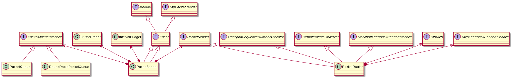

# pacing

## 1. Pacer

* SetEstimatedBitrate()：配置估算的码率
* SetPacingRates()：设置pace的码率和padding的码率
* SetEstimatedBitrateAndCongestionWindow()配置估算的码率和滑动窗口
* OnBytesAcked()：发送的数据确认时调用
* InsertPacket()：输入rtp数据
* TimeUntilNextProcess/Process：实现Module接口

## 2. BitrateProber

BitrateProber也是PacedSender的属性类，第一眼看到BitrateProber这个类名时以为是类似网速探测功能的，其实不然，BitrateProber只是为了维持一段时间和数据量内发送的网速不低于某一比特率，（其实也是探测网速的一个辅助功能，只有发送足量的数据，才好测量当前网速），所以在整个直播生命周期中，该类激活的时间比较短。一般检测到网速突变时会触发。

核心流程：

1. 在PacedSender::PacedSender中创建BitrateProber对象prober_
2. 在PacedSender::CreateProbeCluster中调用prober_->CreateProbeCluster创建新的cluster
3. 在PacedSender::SetProbingEnabled中调用prober_->SetEnabled开启或者关闭probe
4. 在PacedSender::InsertPacket中调用prober_->OnIncomingPacket输入当前包的字节
5. 在PacedSender::TimeUntilNextProcess中调用prober_->TimeUntilNextProbe获取下一次probe的调度时间
6. 在PacedSender::Process中调用prober_->RecommendedMinProbeSize获取下一次probe发送的字节数（pacer中发送的字节数）
7. 在PacedSender::Process中调用prober_->ProbeSent(now_ms, bytes_sent)更新本次发送的字节数

## 3. IntervalBudget

IntervalBudget主要用于按照一定的码率控制数据在时间上的分配，保存着这波发送应该有多少资源要发送，实际上他并不能控制这一波能发送多少，只能控制如果上N波发送的数据过多的话，把这一波的数据消耗完了，那么这一波就不发送了。  

核心流程：

1. 在PacedSender::PacedSender创建IntervalBudget对象media_budget_和padding_budget_
2. 在PacedSender::Process中调用media_budget_->set_target_rate_kbps设置目标码率；在PacedSender::SetEstimatedBitrate中调用padding_budget_->set_target_rate_kbps设置目标码率
3. 在PacedSender::SendPacket中调用media_budget_->bytes_remaining判断是否还能继续发包
4. 在PacedSender::UpdateBudgetWithElapsedTime中调用media_budget_->IncreaseBudget更新bytes_remaining_（增加），padding_budget_也是如此
5. 在PacedSender::UpdateBudgetWithBytesSent中调用media_budget_->UseBudget更新bytes_remaining_（消耗），padding_budget_也是如此

## 4. PacketQueueInterface/PacketQueue/RoundRobinPacketQueue

PacketQueueInterface：用于存放packet（实际上就是rtp包）的基类
PacketQueue：PacketQueueInterface的一个实现，但是目前好像没有用到
RoundRobinPacketQueue：轮询调度的一个带优先级的队列。在pacer中使用。

## 5. PacedSender

核心流程：

1. 在RtpTransportControllerSend::RtpTransportControllerSend中创建PacedSender对象pacer_。并传入send_side_cc_。也可以通过RtpTransportControllerSend::packet_sender()返回pacer_。
2. 在RtpTransportControllerSend::SetQueueTimeLimit中调用pacer_.SetQueueTimeLimit设置queue的最大缓冲。
3. 在RtpTransportControllerSend::GetPacerQueuingDelayMs中调用pacer_.QueueInMs获取pacer造成的时延。
4. 在RtpTransportControllerSend::GetFirstPacketTimeMs中调用pacer_.FirstSentPacketTimeMs获取第一个包的发送时间。
5. 在SendSideCongestionController::SetAllocatedSendBitrateLimits中调用pacer_->SetSendBitrateLimits设置最小发送码率和填充码率
6. 在SendSideCongestionController::SendProbes中调用pacer_->CreateProbeCluster创建探测的对象。
7. 在SendSideCongestionController::Process()中调用pacer_->Pause()/pacer_->Resume()暂停和重启pacer，调用pacer_->GetApplicationLimitedRegionStartTime获取alr的启动时间。
8. 在SendSideCongestionController::SetPacingFactor中调用pacer_->SetPacingFactor设置pacer的因子。用于控制探测的码率。
9. 在SendSideCongestionController::MaybeTriggerOnNetworkChanged中调用pacer_->SetEstimatedBitrate设置估算码率，调用pacer_->ExpectedQueueTimeMs获取大概多少时间把pacer队列的数据发完。
10. 在RTPSender::ReSendPacket/RTPSender::SendToNetwork中调用paced_sender_->InsertPacket输入rtp包数据
11. 在PacedSender::Process的过程中最后会调用RTPSender::TimeToSendPacket将包数据发送出去。

## 6. PacketRouter

用于协助pacer中用于发送数据以及处理feedback消息。  
核心流程：  

1. 在RtpTransportControllerSend中创建（作为成员变量），传递给pacer_，同时也可以通过RtpTransportControllerSend::packet_router()返回。
2. 通过RtpVideoStreamReceiver构造函数调用packet_router_->AddReceiveRtpModule添加接收侧的rtp_rtcp_module。
3. 在Channel::RegisterSenderCongestionControlObjects中调用packet_router->AddSendRtpModule添加发送侧的rtp_rtcp_module。
4. 在Channel::RegisterReceiverCongestionControlObjects中调用packet_router->AddReceiveRtpModule添加接收侧的rtp_rtcp_module。
5. 在RtpVideoSender::RtpVideoSender中遍历rtp_rtcp_module模块并调用AddSendRtpModule添加发送侧的rtp_rtcp_module。
6. 在创建AudioReceiveStream和VideoReceiveStream时会传入PacketRouter对象。
