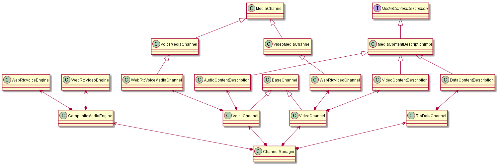

# Channel核心关系

[toc]

## 1. Channel的关系图谱

## 2. ChannelManager

在ChannelManager中，media_engine_的接口调用在单独的线程(network_thread_)中，并创建和维护voice/video/data等各类channel。  

核心流程：  

1. 在PeerConnectionFactory::Initialize()中会创建ChannelManager对象，并传入PeerConnection中，在PeerConnection中会调用CreateXXXChannel创建对应的channel对象
2. 在启动前，通过GetSupportedXXXCodecs，获取支持的audio/video/data类型的编码格式，底层实际上通过media_engine_/data_engine_获取
3. 调用SetVideoRtxEnabled()设置是否支持rtx，需要在Init()前调用
4. 通过Init()/Terminate()，启动和停止media_engine_
5. 调用**CreateVoiceChannel()**/DestroyVoiceChannel()创建和销毁audio channel
6. 调用**CreateVideoChannel()**/DestroyVideoChannel()创建和销毁video channel
    - 调用CompositeMediaEngine::CreateVideoChannel()创建media_channel，实际调用的是WebRtcVideoEngine::CreateChannel()
    - 使用media_channel创建VideoChannel
7. 调用CreateRtpDataChannel()/DestroyRtpDataChannel()创建和销毁data channel

## 3. BaseChannel

BaseChannel是VoiceChannel/VideoChannel/RtpDataChannel的共同的基类，因此通用逻辑会在此处理。  
这里有几个函数后缀特征：_n后缀的函数需要在network线程中调用，_w后缀的函数需要在worker线程中调用，_s后缀的函数需要在signaling线程中调用。  

核心流程：  

1. 调用Init_w()/Deinit()初始化和去初始化，需要注意的是Deinit()必须在子类析构中调用，可以调用多次
2. 调用BaseChannel::SetRtpTransport()设置rtp_transport_对象
    - rtp_transport_绑定回调函数，包括：OnTransportReadyToSend(), OnRtcpPacketReceived(), OnNetworkRouteChanged(), OnWritableState(), SignalSentPacket_n()等
3. 调用SetLocalContent()设置local sdp。会调用子类audio/video/rtpdata的SetLocalContent_w()
4. 调用SetRemoteContent()设置remote sdp。会调用子类audio/video/rtpdata的SetRemoteContent_w()
5. 回调OnRtpPacket()，实现RtpPacketSinkInterface接口，接收一个rtp包(已完成解析)
    - BaseChannel::ProcessPacket()
      - WebRtcVideoChannel::OnPacketReceived()

### 4. VoiceChannel/VideoChannel，下述以VideoChannel为例

VideoChannel主要实现video通道的相关操作，主要是SetLocalContent_w()和SetRemoteContent_w()。  

核心流程：  

1. VideoChannel::SetLocalContent_w()，由BaseChannel::SetLocalContent()触发
    - 从local sdp中获取参数(如codecs, rtp_extensions)，调用media_channel()->SetRecvParameters()。其中media_channal()返回VideoMediaChannel对象
    - 调用UpdateLocalStreams_w()更新local_streams_
2. VideoChannel::SetRemoteContent_w()，由BaseChannel::SetRemoteContent()触发
    - 从remote sdp中获取参数(如codecs, rtp_extensions)，调用media_channel()->SetSendParameters()
    - 调UpdateRemoteStreams_w()用更新remote_streams_

### 5. WebRtcVideoChannel

核心流程：  

1. 通过WebRtcVideoEngine::CreateChannel()创建
2. 调用AddSendStream()/RemoveSendStream()添加/删除一路WebRtcVideoSendStream
3. 调用AddRecvStream()/RemoveRecvStream()添加/删除一路WebRtcVideoReceiveStream
4. 当设置remote sdp信息时，调用SetSendParameters()设置发送端参数，触发WebRtcVideoChannel::WebRtcVideoSendStream::SetSendParameters()
    - 当底层VideoSendStream还没创建时，会调用WebRtcVideoChannel::WebRtcVideoSendStream::RecreateWebRtcStream()创建VideoSendStream对象
5. 当设置local sdp信息时，调用SetRecvParameters()设置接收端参数，触发WebRtcVideoChannel::WebRtcVideoReceiveStream::SetRecvParameters()
    - 当需要接收flexfec时，调用WebRtcVideoChannel::WebRtcVideoReceiveStream::MaybeRecreateWebRtcFlexfecStream()创建FlexfecReceiveStream对象
    - 当需要创建video流时，调用WebRtcVideoChannel::WebRtcVideoReceiveStream::RecreateWebRtcVideoStream()创建VideoReceiveStream对象
6. 调用SetVideoSend()重新设置底层VideoSendStream对象stream_的source
7. 调用SetSink()保存sink_，后续WebRtcVideoChannel::WebRtcVideoReceiveStream::OnFrame()会调用sink_->OnFrame()
8. 当收到rtp包时，会调用OnPacketReceived()，进而调用call_->Receiver()->DeliverPacket()
9. 当收到rtcp包时，会调用call_->Receiver()->DeliverPacket()
10. 当网络发生变化时，会调用OnNetworkRouteChanged()，进而触发底层call_的接口，如call_->GetTransportControllerSend()->OnNetworkRouteChanged()