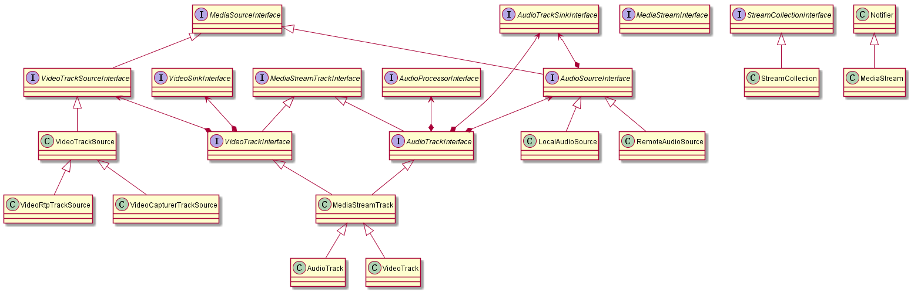

# PeerConnection核心关系

[toc]

## 1. PeerConnectionFactory核心代码

PeerConnection工厂类，用于创建PeerConnection。PeerConnectionFactory的类结构如下所示。  

```c++
// 伪代码
class PeerConnectionFactoryInterface {
public:
    CreatePeerConnection();
    CreateLocalMediaStream();
    CreateAudioSource();
    CreateVideoSource();
    CreateVideoTrack();
    CreateAudioTrack();
};

class PeerConnectionFactory : public PeerConnectionFactoryInterface {
public:
    Initialize();
private:
    rtc::Thread* network_thread_;   // 网络收发相关线程
    rtc::Thread* worker_thread_;    // 工作线程，大部分的处理都在这些
    rtc::Thread* signaling_thread_; // 信令线程

    std::unique_ptr<cricket::ChannelManager> channel_manager_;
    std::unique_ptr<rtc::BasicNetworkManager> default_network_manager_;
    std::unique_ptr<rtc::BasicPacketSocketFactory> default_socket_factory_;
    std::unique_ptr<cricket::MediaEngineInterface> media_engine_;
    std::unique_ptr<webrtc::CallFactoryInterface> call_factory_;
    std::unique_ptr<RtcEventLogFactoryInterface> event_log_factory_;
    std::unique_ptr<FecControllerFactoryInterface> fec_controller_factory_;
    std::unique_ptr<NetworkControllerFactoryInterface> injected_network_controller_factory_;
    std::unique_ptr<NetworkControllerFactoryInterface> bbr_network_controller_factory_;
};
```

核心流程：  

1. 调用webrtc::CreatePeerConnectionFactory()创建PeerConnectionFactory，创建三个线程：network_thread_，worker_thread_，signaling_thread_。也包括创建AudioProcessing，MediaEngineInterface，CallFactoryInterface，RtcEventLogFactoryInterface等对象。
2. 调用Initialize()，创建default_network_manager_，default_socket_factory_，channel_manager_等对象。channel_manager_开启rtx;
3. 调用CreatePeerConnection()，创建PeerConnection。其中配置参数包括ICE连接建立的STUN/TURN服务器等。
4. 调用CreateLocalMediaStream()，创建local_stream。
    - 音频source：调用CreateAudioSource创建audio_source，调用CreateAudioTrack创建audio_track，调用local_stream->AddTrack()
    - 视频source：调用CreateVideoSource创建video_source，调用CreateVideoTrack创建video_track，调用local_stream->AddTrack()

## 2. PeerConnection交互时序图

素材来源：<https://www.jianshu.com/p/43957ee18f1a>


### 2.1 PeerConnection交互时序图


通信过程中的基本概念：

* **Room**：Signaling Server使用Room的概念对同一组通信的peers进行配对管理，一个room中包含有1个或者多个peers。当没有peers存在时room销毁；当第一个peer连接到signaling server时执行create room动作，此时因为没有其他peers，建立room的这个peer不与其他节点建立P2P通信；其他peers随后加入room，加入room后会主动与room已经存在的peer建立连接；
* **Offer**：主动与其他peer建立P2P链接的peer把自己的SDP信息整理好，通过signaling server转发给room里面的其他peer，这个SDP信息包就是Offer；
* **Answer**：被动连接的Peer在收到signaling server转发的其他peer的offer信息以后，也把自己的SDP信息整理好，同样通过signaling server转发给主动连接它的peer，他自己的SDP信息包就是Answer；
* **IceCandidate**：Peer与ICE/TURN/STUN Server直接建立连接，获取自己的NAT类型以及外网IP和端口，这些ICE/TURN/STUN Server返回的消息就是IceCandidate或者直接简称Candidate；

### 2.2 ICE Candidate交互时序图


* 首先ClientA和ClientB均通过双向通信方式如WebSocket连接到Signaling Server上；
* ClientA在本地首先通过GetMedia访问本地的media接口和数据，并创建PeerConnection对象，调用其AddStream方法把本地的Media添加到PeerConnection对象中。对于ClientA而言，既可以在与Signaling Server建立连接之前就创建并初始化PeerConnection如阶段1，也可以在建立Signaling Server连接之后创建并初始化PeerConnection如阶段2；ClientB既可以在上图的1阶段也可以在2阶段做同样的事情，访问自己的本地接口并创建自己的PeerConnection对象。
* 通信由ClientA发起，所以ClientA调用PeerConnection的CreateOffer接口创建自己的SDP offer，然后把这个SDP Offer信息通过Signaling Server通道中转发给ClientB；
* ClientB收到Signaling Server中转过来的ClientA的SDP信息也就是offer后，调用CreateAnswer创建自己的SDP信息也就是answer，然后把这个answer同样通过Signaling server转发给ClientA；
* ClientA收到转发的answer消息以后，两个peers就做好了建立连接并获取对方media streaming的准备；
* ClientA通过自己PeerConnection创建时传递的参数等待来自于ICE server的通信，获取自己的candidate，当candidate available的时候会自动回调PeerConnection的OnIceCandidate；
* ClientA通过Signling Server发送自己的Candidate给ClientB，ClientB依据同样的逻辑把自己的Candidate通过Signaling Server中转发给ClientA；
* 至此ClientA和ClientB均已经接收到对方的Candidate，通过PeerConnection建立连接。至此P2P通道建立。

## 3. PeerConnection核心代码

PeerConnection的类结构如下所示:

```c++
// 伪代码
class PeerConnectionInterface {
public:
    AddTrack();
    RemoveTrack();
    AddTransceiver();
    CreateDataChannel();
    CreateOffer();
    CreateAnswer();
    SetLocalDescription();
    SetRemoteDescription();
    AddIceCandidate();
    RemoveIceCandidates();
};

class PeerConnection : public PeerConnectionInterface {
public:
    Initialize();
private:
    rtc::scoped_refptr<PeerConnectionFactory> factory_;
    PeerConnectionObserver* observer_ = nullptr;
    SignalingState signaling_state_ = kStable;
    IceConnectionState ice_connection_state_ = kIceConnectionNew;
    IceGatheringState ice_gathering_state_ = kIceGatheringNew;
    PeerConnectionInterface::RTCConfiguration configuration_;
    rtc::scoped_refptr<StreamCollection> local_streams_;
    rtc::scoped_refptr<StreamCollection> remote_streams_;
    std::vector<rtc::scoped_refptr<RtpTransceiverProxyWithInternal<RtpTransceiver>>> transceivers_;
};
```

核心流程：

1. 调用PeerConnectionFactory::CreatePeerConnection()，创建PeerConnection对象，初始化local_streams_，remote_streams_对象。还包括调用Initialize()，初始化observer_，configuration_。
2. 调用CreateOffer()发起offer，进而调用WebRtcSessionDescriptionFactory::CreateOffer()，进而调用WebRtcSessionDescriptionFactory::InternalCreateOffer
    - 通过MediaSessionDescriptionFactory::CreateOffer()创建sdp描述对象SessionDescription。
    - 用SessionDescription对象创建JsepSessionDescription对象offer，拷贝candidates到offer中，**返回Create成功**
3. 调用CreateAnswer()响应answer，进而调用WebRtcSessionDescriptionFactory::CreateAnswer()，进而调用WebRtcSessionDescriptionFactory::InternalCreateAnswer
    - 通过MediaSessionDescriptionFactory::CreateAnswer()创建sdp描述对象SessionDescription。
    - 用SessionDescription对象创建JsepSessionDescription对象answer，拷贝candidates到offer中，**返回Create成功**
4. 调用SetLocalDescription()设置local sdp，进而调用ApplyLocalDescription()。SetLocalDescription完成后调用JsepTransportController::MaybeStartGathering()进行ice收集。
    - ApplyLocalDescription，应用local desc，可能是offer，也可能是answer
      - 调用PushdownTransportDescription，将desc透传到JsepTransportController
      - 如果desc的类型是offer，调用PeerConnection::CreateChannels()，**创建Voice/Video Channel**
      - 更新信令状态，如kHaveLocalOffer/kHaveRemoteOffer等
      - 调用**PushdownMediaDescription**，遍历transceivers_中的transceiver，调用其channel的**SetLocalContent()**
5. offer/answer协商后，调用SetRemoteDescription()设置remote sdp，进而调用ApplyRemoteDescription()。回调OnSetRemoteDescriptionComplete()。
    - ApplyRemoteDescription，应用local desc，可能是offer，也可能是answer
      - PushdownTransportDescription，将desc透传到JsepTransportController
      - 如果desc的类型是offer，调用PeerConnection::CreateChannels()，**创建Voice/Video Channel**
      - 更新信令状态，如kHaveLocalOffer/kHaveRemoteOffer等
      - 调用**PushdownMediaDescription**，遍历transceivers_中的transceiver，调用其channel的**SetRemoteContent()**
6. ice协商后，调用AddIceCandidate()向ice agent添加一个ice candidate。进而调用UseCandidate()。
7. 调用AddStream()添加local stream到local_streams_。遍历并添加local stream中的音视频track。
8. 调用CreateDataChannel()创建DataChannel，便于后续发送数据。常用于后台传输内容, 例如: 图像, 文件传输, 聊天文字, 游戏数据更新包, 等等。

## 4. PeerConnection中的MediaStream&Track

### 4.1 MediaStream & MediaTrack & MediaSource 关系图



### 4.2 MediaStream

核心流程：

1. 通过PeerConnectionFactory::CreateLocalMediaStream()根据stream_id创建MediaStream对象
2. 调用AddTrack()添加音频track，后续可以调用RemoveTrack()移除音频track，此时会触发FireOnChanged()
3. 调用AddTrack()添加视频track，后续可以调用RemoveTrack()移除视频track，此时会触发FireOnChanged()
4. 其他诸如FindAudioTrack()、FindVideoTrack()、GetAudioTracks和GetVideoTracks可以返回特定或者全部的track

### 4.3 AudioTrack

核心流程：

1. 通过PeerConnectionFactory::CreateAudioSource()创建audio_source
2. 通过PeerConnectionFactory::CreateAudioTrack(audio_source)创建audio_track
3. 调用AddSink()为audio_source添加audio_sink，后续可以调用RemoveSink()移除audio_sink

### 4.4 VideoTrack

核心流程：

1. 通过PeerConnectionFactory::CreateVideoSource()创建video_source
2. 通过PeerConnectionFactory::CreateVideoTrack(video_source)创建video_track
3. 调用AddOrUpdateSink()为video_source添加video_sink，后续可以调用RemoveSink()移除video_sink
