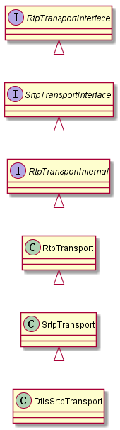

# rtp transport

[toc]

核心调用关系：  

* 在channel.h中BaseChannel类保存相关对象：webrtc::RtpTransportInternal* rtp_transport_ = nullptr
* 由外部通过函数SetRtpTransport(webrtc::RtpTransportInternal* rtp_transport)对rtp_transport_进行赋值
* 而通常在channel（audio/video/data）在创建时就会调用SetRtpTransport进行赋值
* 而rtp transport实际是在JsepTransportController::MaybeCreateJsepTransport()创建的，主要是根据sdp中的m行，索引标签可以是mid信息

## 1. RtpTransportInterface/SrtpTransportInterface

* GetRtpPacketTransport()：返回PacketTransportInterface对象，用于发送rtp包
* GetRtcpPacketTransport()：返回PacketTransportInterface对象，用于发送rtcp包，如果rtp/rtcp复用，则返回null
* SetParameters(const RtpTransportParameters& parameters)/GetParameters()：设置或者获取参数，例如mux, reduced-size rtcp, cname等

* SetSrtpSendKey(const cricket::CryptoParams& params)：设置srtp发送key param
* SetSrtpReceiveKey(const cricket::CryptoParams& params)：设置srtp接收key param

## 2. RtpTransportInternal

* SetRtcpMuxEnabled(bool enable)：设置mux
* rtcp_mux_enabled()：获取是否mux
* rtp_packet_transport()/SetRtpPacketTransport(rtc::PacketTransportInternal* rtp)：获取/设置rtp transport
* rtcp_packet_transport()/SetRtcpPacketTransport(rtc::PacketTransportInternal* rtcp)：获取/设置rtcp transport
* IsReadyToSend()：是否可以发送
* SendRtpPacket()/SendRtcpPacket()：发送rtp/rtcp包
* UpdateRtpHeaderExtensionMap()：更新扩展
* IsSrtpActive()/IsWritable()：是否active/writable
* RegisterRtpDemuxerSink()/UnregisterRtpDemuxerSink()：设置接收rtp/rtcp sink

## 3. RtpTransport

* 实现RtpTransportInternal相关接口，其中rtp相关调用rtp_packet_transport_，rtcp相关调用rtcp_packet_transport_

## 4. SrtpTransport

* SetSrtpSendKey()/SetSrtpReceiveKey()：设置发送/接收key param
* SendRtpPacket()/SendRtcpPacket()：发送rtp/rtcp包
* IsSrtpActive()/IsWritable()：返回是否active/writeable
* SetRtpParams()/SetRtcpParams()：设置发送和接收rtp/rtcp参数，如key，扩展
* ResetParams()：重置参数
* EnableExternalAuth()/IsExternalAuthEnabled()/IsExternalAuthActive()：设置/获取是否允许外部填写auth tag
* GetSrtpOverhead()：获取srtp over head长度
* GetRtpAuthParams()：获取rtp的auth param，如key，tag len等

## 5. DtlsSrtpTransport

* SetDtlsTransports()：设置rtp/rtcp的dtls transport
* SetRtcpMuxEnabled()：启用复用rtp/rtcp
  * SetupRtpDtlsSrtp()：获取rtp发送/接收密钥，并设置或者更新密钥
  * SetupRtcpDtlsSrtp()：或者rtcp发送/接收密钥，并设置或者更新密钥
* UpdateSendEncryptedHeaderExtensionIds()：设置或者更新发送扩展，并更新dtls srtp相关信息，如密钥
* UpdateRecvEncryptedHeaderExtensionIds()：设置或者更新接收扩展，并更新dtls srtp相关信息，如密钥
* SetSrtpSendKey()/SetSrtpReceiveKey()：dtls srtp不支持此方法
* SetActiveResetSrtpParams()：如果true，则dtls transport更新时会更新srtp param
