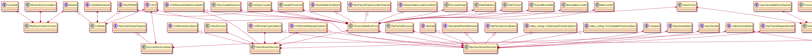

# video

## 1. CallStats

* CallStats::RegisterStatsObserver()：注册observer，在CallStats::Process中统计rtt时，遍历observer，并调用observer->OnRttUpdate
* CallStats::LastProcessedRtt()：返回当前统计的平均rtt（历史rtt权重0.7，当前rtt权重0.3）

## 2. EncoderRtcpFeedback

* EncoderRtcpFeedback::OnReceivedIntraFrameRequest()：在RTCPReceiver::TriggerCallbacksFromRtcpPacket()中当收到I帧请求(rtcp fir/pli)时，更新对应ssrc的I帧请求时间，调用video_stream_encoder_->SendKeyFrame()。

## 3. OveruseFrameDetector

核心流程：  

1. 在CreateVideoStreamEncoder()创建OveruseFrameDetector对象overuse_detector_，并传入VideoStreamEncoder对象中。
2. 在VideoStreamEncoder::ReconfigureEncoder()中调用overuse_detector_->StartCheckForOveruse启动CheckOveruseTask，用于check
3. 在VideoStreamEncoder::Stop()中调用overuse_detector_->StopCheckForOveruse()停止check
4. 在VideoStreamEncoder::SetSource中另外启动task，task中调用overuse_detector_->OnTargetFramerateUpdated(max_framerate_)通知framerate发生改变
5. 在VideoStreamEncoder::EncodeVideoFrame中调用overuse_detector_->FrameCaptured(out_frame, time_when_posted_us)输入编码前的out_frame
6. 在VideoStreamEncoder::OnEncodedImage中另外启动task，task中调用overuse_detector_->FrameSent，更新时间信息，包括时戳，发送时间，采集时间，编码时间等
7. 在CheckOveruseTask中周期调用OveruseFrameDetector::CheckForOveruse函数进行overuse统计

## 4. QualityThreshold

统计max_measurements个元素，在这个阶段内的state。如果有超过max_measurements * fraction个元素大于high_threshold，则state=high；如果有超过max_measurements * fraction个元素小于low_threshold，则state=low

## 5. ReceiveStatisticsProxy

核心流程：  

1. 在VideoReceiveStream构造函数中创建ReceiveStatisticsProxy对象stats_proxy_，并传入RtpVideoStreamReceiver，video_coding::FrameBuffer，VideoStreamDecoder
2. 在VideoReceiveStream::Start()中调用stats_proxy_.DecoderThreadStarting()开始统计。
3. 在VideoReceiveStream::Stop()中调用stats_proxy_.OnUniqueFramesCounted()添加统计数据。调用stats_proxy_.DecoderThreadStopped()停止统计。
4. 在VideoReceiveStream::GetStats()中调用stats_proxy_.GetStats()返回统计数据
5. 在VideoReceiveStream::OnFrame中调用stats_proxy_.OnSyncOffsetUpdated添加同步数据，调用stats_proxy_.OnRenderedFrame添加视频渲染帧数据
6. 在VideoReceiveStream::OnEncodedImage中调用stats_proxy_.OnPreDecode添加解码前视频帧数据
7. 在VideoReceiveStream::Decode()中调用stats_proxy_.OnStreamInactive()通知in active状态
8. 在VideoStreamDecoder::FrameToRender中调用receive_stats_callback_->OnDecodedFrame添加解码后帧数据
9. 在VideoStreamDecoder::OnIncomingPayloadType中调用receive_stats_callback_->OnIncomingPayloadType添加pt数据
10. 在VideoStreamDecoder::OnDecoderImplementationName调用receive_stats_callback_->OnDecoderImplementationName添加name
11. 在VideoStreamDecoder::OnReceiveRatesUpdated中调用receive_stats_callback_->OnIncomingRate添加码率帧率数据
12. 在VideoStreamDecoder::OnDiscardedPacketsUpdated中调用receive_stats_callback_->OnDiscardedPacketsUpdated添加丢弃rtp包数据
13. 在VideoStreamDecoder::OnFrameCountsUpdated中调用receive_stats_callback_->OnFrameCountsUpdated添加帧数数据

## 6. RtpStreamsSynchronizer

核心流程：  

1. 在VideoReceiveStream构造函数中创建RtpStreamsSynchronizer对象rtp_stream_sync_
2. 在VideoReceiveStream::SetSync中调用rtp_stream_sync_.ConfigureSync(audio_syncable)关联audio/video
3. 在VideoReceiveStream::OnFrame中调用rtp_stream_sync_.GetStreamSyncOffsetInMs获取同步时间数据

* 在RtpStreamsSynchronizer::ConfigureSync中根据audio/video Syncable创建StreamSynchronization对象sync_
* 在RtpStreamsSynchronizer::Process中根据audio/video当前的时间信息，计算出audio/video的目标播放时延
* 在RtpStreamsSynchronizer::GetStreamSyncOffsetInMs中根据audio当前播放时间，参数中视频的渲染时间，计算两者的offset

## 7. RtpVideoStreamReceiver

核心流程：  

1. 在VideoReceiveStream构造函数中创建RtpVideoStreamReceiver对象rtp_video_stream_receiver_
2. AddReceiveCodec()：添加codec参数，可能有多个
3. StartReceive()/StopReceive()：设置receiving_状态
4. GetSyncInfo()：获取同步时间信息
5. DeliverRtcp()：输入rtcp包
6. FrameContinuous()：根据当前连续序号清除nack_module_相关序号
7. FrameDecoded()：根据当前已经解码的序号，清除packet_buffer_和reference_finder_相关序号
8. OnRtpPacket()：输入rtp包，可能是网络来的，也可能是fec恢复的。将解析后的rtp包调用OnReceivedPayloadData()放入packet_buffer_中。
9. OnRecoveredPacket()：处理恢复后的rtp包
10. RequestKeyFrame()：调用rtp_rtcp_模块的请求I帧接口RequestKeyFrame()
11. ResendPackets()：调用rtp_rtcp_发送nack接口
12. OnReceivedFrame()：收到一帧数据的处理动作
13. OnCompleteFrame()：收到一帧完整帧的处理动作，通知VideoReceiveStream对象
14. LastReceivedPacketMs()：调用packet_buffer_函数返回上一次接收的包的时间
15. LastReceivedKeyframePacketMs()：调用packet_buffer_函数返回上一次接收的I帧的包的时间

## 8. SendDelayStats

核心流程：

1. 在Call构造函数中创建SendDelayStats对象video_send_delay_stats_
2. 在Call::CreateVideoSendStream中调用video_send_delay_stats_->AddSsrcs(config)添加当前流的ssrcs，加入ssrc_集合中。并将video_send_delay_stats_对象传入VideoSendStream中。
3. 在Call::OnSentPacket中当发送完成packet后，调用video_send_delay_stats_->OnSentPacket
4. 在RTPSender::UpdateOnSendPacket中当要发送packet时，调用send_packet_observer_->OnSendPacket，此时send_packet_observer_实际上是SendDelayStats对象

## 9. VideoQualityObserver

核心流程：

1. 在ReceiveStatisticsProxy构造函数中创建VideoQualityObserver对象video_quality_observer_
2. 在ReceiveStatisticsProxy::OnDecodedFrame中当发现content_type发生改变时，重新创建VideoQualityObserver对象video_quality_observer_。接着调用video_quality_observer_->OnDecodedFrame进行解码后数据统计。

## 10. VideoSendStreamImpl

核心流程：

1. 在VideoSendStream构造函数中会创建VideoSendStreamImpl对象send_stream_
2. 在VideoSendStream::Start()会在worker线程调用send_stream_->Start()。主要是有以下几个操作：
   - 添加bitrate_allocator_的observer(this)
   - 启动encoder activity的check task
   - 向编码器要求编I帧

## 11. VideoStreamDecoder

核心流程：  

1. 在VideoReceiveStream::Start()中创建VideoStreamDecoder对象video_stream_decoder_。在VideoStreamDecoder的构造函数中会创建数据传递链路，其中video_receiver_->RegisterReceiveCallback(this);除了这个之外，video_receiver_还进行了其他操作，例如配置nack settings，注册frame type回调，注册接收数据统计回调，设置fec/nack模式等

## 12. VideoStreamEncoder

核心流程：

1. 在VideoSendStream构造函数中创建VideoStreamEncoder对象video_stream_encoder_，同时传递给VideoSendStreamImpl。注册bitrate allocation的observer，实际上是VideoSendStreamImpl
2. SetSource()/SetSink()：建立数据链路，source -> encoder -> sink
